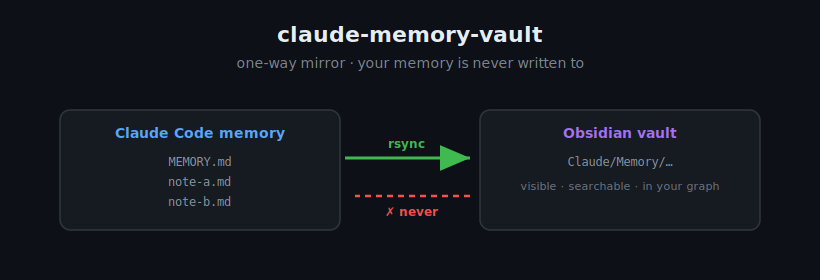
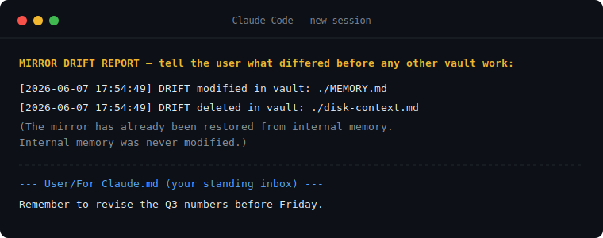

<div align="center">

# claude-memory-vault

**A one-way mirror of [Claude Code](https://claude.com/claude-code)'s memory into your [Obsidian](https://obsidian.md) vault — so you can finally *see* what Claude remembers, with zero risk to the source of truth.**




</div>

> **Requires macOS 15+ (Sequoia or later).** The mirror pins Apple's openrsync and uses BSD `realpath`/`stat`; macOS 14 (which ships GNU rsync) and Linux/Windows are **refused at install time**, not silently broken. Cross-platform is the flagship [good-first-issue](../../issues).

## What it does

Claude Code keeps a memory of your work in invisible files you never see. This tool mirrors that memory into a folder in your Obsidian vault, so it becomes **visible, searchable, and part of your graph** — while guaranteeing:

- 🔒 **Your memory is never written to.** Data flows one way only. There is no reverse code path.
- 🪞 **The vault never wins.** Edit or delete a mirrored file in Obsidian and it's detected, logged as evidence, reported to you at the next session start, then restored from memory. Your change is never propagated back.
- 🗂 **Clear ownership zones.** `Claude/` is the mirror; `User/` is yours (Claude reads, never writes); `Shared/` is for both. Plus an inbox file Claude reads at the start of every session.



## Quickstart

```bash
git clone https://github.com/Gustavogcps/claude-memory-vault.git
cd claude-memory-vault
./install.sh            # detects your paths, installs hooks, merges settings.json safely
# then restart Claude Code
```

`install.sh` is interactive: it asks for your vault path (default `~/Claude Vault`) and whether to scaffold the `Claude/` `User/` `Shared/` zones. **Nothing destructive runs during install** — the mirror only syncs on your next session. (Note: Claude's memory source appears after Claude Code saves its first auto-memory, so a brand-new setup may mirror nothing until then.)

That's it. Your next session begins with a clean sync — or a drift report if anything in the mirror was changed. See [`docs/DESIGN.md`](docs/DESIGN.md) for the full design and [`docs/ARCHITECTURE.md`](docs/ARCHITECTURE.md) for how it works.

## Battle-tested

A round of review that ran *real attacks* against the built scripts (not just reading the design) found a **critical** bug: a malicious symlink at the mirror root could make `rsync --delete` follow it and destroy data **outside** the vault. It's fixed (guard 4b + a pre-`rsync` re-check for the race), regression-tested, and the whole story — five review rounds, the multi-agent red-team, three other majors, and the bugs that document review *missed* — is in **[docs/RED-TEAM.md](docs/RED-TEAM.md)**.

The lesson, if you take one thing: *reading a design finds design bugs; running it finds real ones.* Which is why the [test suite](tests/run-tests.sh) actually exercises the destructive `rsync --delete` logic — in disposable sandboxes — so you can watch the guarantees hold:

```bash
tests/run-tests.sh     # 62 checks, all in /private/tmp; never touches real data
```

## FAQ

**Is my Claude memory safe?** Yes — by design. Nothing in this system writes to the memory directory; it's read-only as a source, and [test 3](tests/run-tests.sh) checksums the whole source tree before and after a restore to prove it stays byte-identical. (As always: AS-IS, no warranty — review the rendered scripts in `~/.claude/hooks/`.)

**What if I edit a mirrored file in Obsidian?** It's detected, logged as evidence *before* anything is touched, reported to you at the next session start, then restored from memory. Your edit is never written back. (If you want to keep notes, use the `User/` or `Shared/` zones, or ask Claude to save to `Claude/Notes/`.)

**Does it work with Obsidian Sync / iCloud?** The mirror works with Obsidian closed and tolerates the vault being offline. Sync-service conflict copies are caught as drift. (Assumes the vault is on local storage, not an iCloud dataless-placeholder path.)

**Will it slow Claude Code down?** No. The per-write hook early-exits in ~2ms (essentially just a bash process spawn — no interpreter, no work) unless you actually touched a memory file.

**Linux / Windows?** macOS-only for now — the design pins openrsync and uses BSD `realpath`/`stat`. Cross-platform support is the flagship [good-first-issue](../../issues). PRs welcome.

## Optional: Obsidian app control

Want Claude to open notes and search *inside* Obsidian's UI? Add the optional [Obsidian MCP server](docs/OBSIDIAN-MCP.md) — one `claude mcp add` command, no code from this project. The mirror works fine without it.

## Roadmap

- Linux support (revisit the rsync pin + BSD calls) — **good first issue**
- Configurable zone names
- Optional periodic background sync (launchd)

## Disclaimer

claude-memory-vault runs `rsync -a --delete` against the `Claude/Memory/` folder inside the vault path you configure — and nowhere else. The destination is guarded by exact-path `realpath` equality, a symlink-escape refusal, a non-empty-source check, a manifest drift check, and a full test suite. Even so, this software is provided **"AS IS", without warranty of any kind** (see [LICENSE](LICENSE)). Review the rendered scripts in `~/.claude/hooks/` before relying on it, and point the vault path at a folder you control.

## Contributing

Issues and PRs welcome — see [CONTRIBUTING.md](CONTRIBUTING.md). Run `tests/run-tests.sh` before submitting. Built by [@Gustavogcps](https://github.com/Gustavogcps). MIT licensed.
